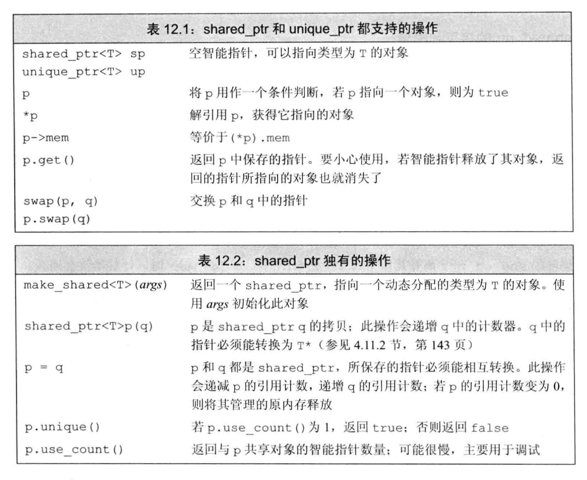
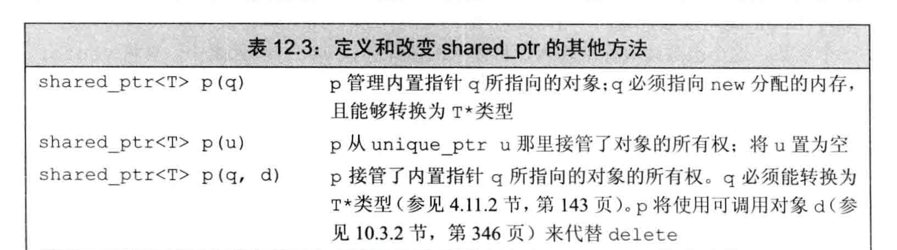
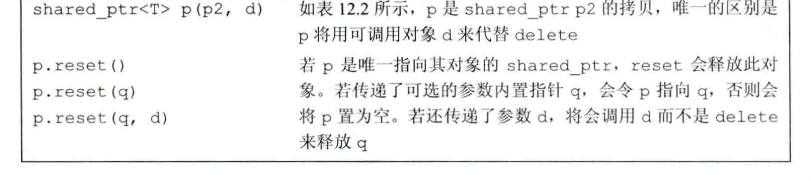
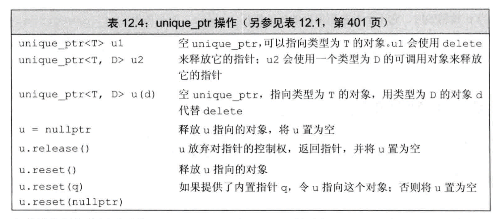
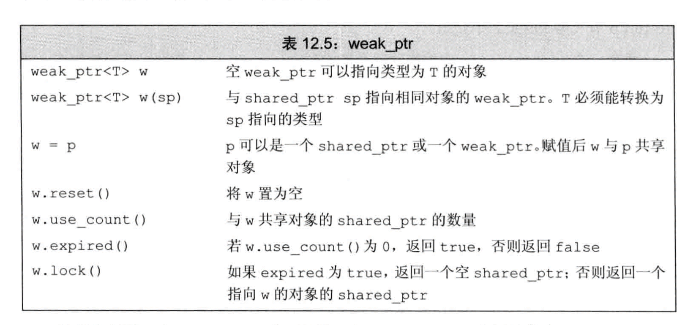
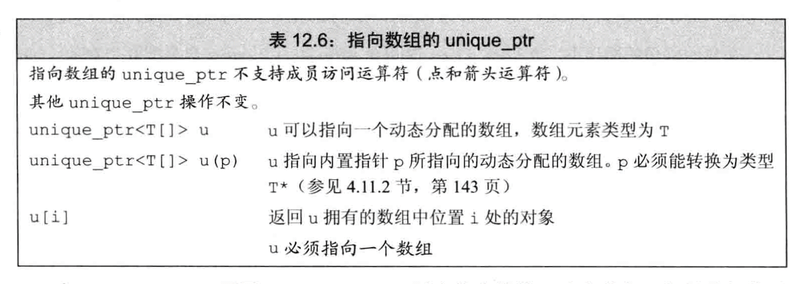
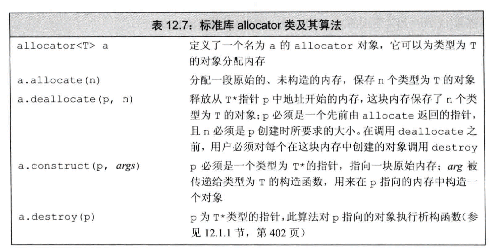

# 动态内存
静态内存：保存局部static对象、类static数据成员以及定义在任何函数之外的变量。  
栈内存：保存定义在内的非static对象。  
自用空间（堆）：程序用堆来存储**动态分配**的对象——即，那些在程序运行时分配的对象。  
静态内存或者栈内存中的对象由编译器自动创建和销毁。对于栈对象，仅在其定义的程序块运行时才存在；static对象在使用之前分配，在程序结束时销毁。  
动态对象的生存周期由程序来控制，我们的代码必须显式地销毁他们。

## 动态内存与智能指针
动态内存的管理是通过一对运算符来实现的：  
**new** 在动态内存中为对象分配空间并返回一个指向该对象的指针，可以选择对对象进行初始化；  
**delete** 接受一个动态对象的指针，销毁该对象，并释放与之关联的内存。  
  
  通过**智能指针**使用动态内存相比new和delete**更容易、更安全**。  
两种智能指针：  
**shared_ptr** 允许多个指针指向同一个对象；  
**unique_ptr** 独占所指向的对象。  
一个伴随类：  
**weak_ptr** 一种弱引用，指向shared_ptr管理的对象。  
这三种类型都定义在**memory头文件**中。

### shared_ptr类
类似vector，智能指针也是模版。
```
shared_ptr<string> p1;
```
  

#### make_shared
最安全的分配和使用动态内存的方法是调用make_shared标准库函数。此函数在动态内存中分配一个对象并初始化它，返回指向此对象的shared_ptr。
#### shared_ptr 的拷贝和赋值
我们可以认为每个shared_ptr都有一个关联的计数器，**引用计数**。  
无论何时我们拷贝一个shared_ptr，计数器都会递增。  
当我们给shared_ptr赋予一个新值或是将其销毁（离开作用域），计数器就会递减。当计数器变为0，它就会自动释放自己所管理的对象。  
shared_ptr通过析构函数完成销毁工作。shared_ptr的析构函数会递减它所指向的对象的引用计数。如果计数变为0，shared_ptr的析构函数就会销毁对象，并释放它占用的内存。  
在最后一个shared_ptr销毁前内存都不会释放，所以**保证shared_ptr在无用之后不再保留**就非常重要。
#### 使用了动态生存期的资源的类
程序使用动态内存出于以下三种原因之一：  
1.程序不知道自己需要使用多少对象  
2.程序不知道所需对象的准确类型  
3.程序需要在多个对象间共享数据  

### 直接管理内存
#### 使用new动态分配和初始化对象
在自由空间分配的内存是无名的，因此**new**无法为其分配的对象命名，而是**返回一个指向该对象的指针**：
```
int *pi = new int;
```
此new表达式在自由空间构造一个int型对象，并返回指向该对象的指针。
```
int *pi = new int(1024)//pi指向的对象的值为1024
int *pi = new int//默认初始化，pi指向对象值不确定
int *pi = new int()//值初始化为0
string *ps = new string//默认初始化为空string
string *ps = new string()//值初始化为空string
```
对动态分配的对象进行初始化通常是个好主意。
#### 动态分配的const对象
一个动态分配的const对象必须进行初始化。初始化完成后，const对象的值就无法修改了。
#### 内存耗尽
一旦一个程序用光了所有可用内存，new表达式就会失败。
```
//默认的new等价于 new (bad_alloc) int;分配失败会抛出std::bad_alloc类型的异常
int *p1 = new int;
int *p2 = new (nothrow) int;//分配失败，new返回一个空指针
```
这种形式的new称为**定位new**。定位new允许我们想new传递额外的参数。
bad_alloc和nothrow都定义在**头文件new**中。
#### 释放动态内存
**delete**执行两个动作：销毁给定的指针指向的对象；释放对应的内存。
```
delete p;
```
#### 指针值和delete
我们传递给delete的指针**必须指向动态分配的内存**，或者是一个空指针。释放一块并非new分配的内存，或者将相同的指针值释放多次，其行为是未定义的。
#### 动态对象的生存期直到被释放为止
由内置指针（而不是智能指针）管理的动态内存在被显式释放前一直都会存在。  
**动态内存的管理非常容易出错！**  
1.忘记delete内存。 2.使用已经释放的对象。 3.同一块内存释放两次。  
坚持只使用智能指针，就可以避免所有这些问题！
#### delete之后重置指针值
```
delete p;
p=nullptr;
```
这样能提供**有限的保护**！
### shared_ptr 和 new 结合使用
```
shared_ptr<int> p1 = new int (1024);//错误：必须使用直接初始化形式
shared_ptr<int> p1(new int (1024));//正确
```
我们不能将一个**内置指针隐式转换为一个智能指针**，**必须使用直接初始化形式**。  
一个用来**初始化智能指针的普通指针必须指向动态内存**，因为智能指针默认使用delete释放他所关联的对象。  
我可以将智能指针绑定到一个指向其他类型的资源的指针上，但是为了这样做，必须提供自己的操作来替代delete！
  
  
#### 不要混合使用普通指针和智能指针
1 shared_ptr可以协调对象的析构（引用计数归零才会析构对象并释放内存），但这仅限于其自身的拷贝（share_ptr之间的拷贝）之间。  
2 使用同一个普通指针初始化多个独立创建的shared_ptr，那么他们的引用计数都为1，而只要其中之一引用计数归零并销毁了指向的对象（他们都指向同一个对象！）那么其他shared_ptr都成了悬空指针!!**这就是推荐使用make_shared的原因！**  
3 当将一个shared_ptr绑定到一个普通指针时，我们就将内存的管理责任交给了这个shared_ptr。一旦这样做了，我们就不应该再使用内置指针来访问shared_ptr指向的内存了。
#### 也不要用get初始化另一个智能指针或为智能指针赋值
##### get
1 智能指针类型定义了一个名为get的函数，它返回一个内置指针，指向智能指针管理的对象。  
2 **此函数只为了一种情况设计**：我们需要向不能使用智能指针的代码传递一个内置指针。  
3 **不要对使用get返回的指针使用delete**，这会使原本管理该对象的智能指针成为悬空指针！  
4 用get初始化另一个智能指针或为智能指针赋值，效果等同于**上方[不要混合使用普通指针和智能指针]第2条**所述，将导致悬空指针！
#### 其他shared_ptr操作
##### reset
我们可以用reset来将一个新的指针赋予一个shared_ptr。
```
p = new int(1024);//错误：不能对智能指针采用赋值操作
p.reset(new int(1024));//正确
```
reset会更新引用计数，若果需要的，会释放p指向的对象。
##### unique
reset常和unique一起使用，当我们是对象唯一的用户时，unique返回true。  
当我们不是唯一用户时，根据需要应当考虑使用:
```
if(!p.unique())
    p.reset(new string(*p));//我们不是唯一用户，为了不影响其他代码，我们使用new一个内置指针来分配 独立的 新拷贝。
*p += newVal;//我们是唯一用户，修改不会对其他代码产生影响。
```

### 智能指针和异常
如果使用内置指针管理内存，在new之后在对应的delete之前发生了异常，会导致内存泄漏。使用智能指针能有效的避免这种情况。
#### 智能指针和哑类
很多为C和C++两种语言设计的类并**没有定义析构函数**，通常要求用户显式地释放所使用的资源。如网络库中常见的connect和disconnect。     
有析构函数的由new创建的对象就算没有被delete，在生存期结束后（如对象定义在函数体内，函数体结束生存期就结束了）会由析构函数自动释放资源。  
**没有析构函数的类型的对象，若不执行显式释放资源，就会导致内存泄露！**
#### 使用我们自己的释放操作
当一个shared_ptr销毁时，它默认地对它管理的指针进行delete操作。如果对象内存不是由new分配的，而我们又想使用shared_ptr来管理这个对象，那么就需要我们自己定义一个函数来替代delete。  
这个**删除器**函数必须能够完成对shared_ptr中保存的指针进行释放的操作。
```
//定义删除器
void end_connection(connection *p){ disconnect(*p);}
void f(destination &d){
    connection c = connect(&d);
    //使用智能指针管理connection类型对象c
    shared_ptr<connection> p(&c,end_connection);
}
```
#### 避免智能指针陷阱
1  不使用相同的内置指针初始化(或reset)多个智能指针；
2  不delete get()返回的指针；
3  不使用get()初始化或reset另一个智能指针；
4  如果你是用get()返回的指针，记住当最后一个对应的智能指针销毁后，你的指针就变为无效了；
5  如果你使用智能指针管理的资源不是new分配的内存，记住传递给它一个删除器；

### unique_ptr
一个unique_ptr“拥有”它所指向的对象。与shared_ptr不同，某个时刻只能有一个unique_ptr指向一个给定对象。当unique_ptr销毁时，它所指向的对象也被销毁。  
与shared_ptr不同，没有类似make_shared的标准库函数返回一个unique_ptr。当我们定义一个unique_ptr时，需要将其绑定到一个new返回的指针上。  
类似shared_ptr，初始化unique_ptr必须采用直接初始化形式。
```
unique_ptr<int> p(new int(42));
```
由于一个unique_ptr拥有它所指向的对象，因此**unique_ptr不支持普通的拷贝和赋值操作**：
```
unique_ptr<string> p1(new string("ccc"));//正确
unique_ptr<string> p2(p1); //错误：不支持拷贝
unique_ptr<string> p3;//正确
p3 = p2; //错误：不支持赋值
```
   

#### reset & release
虽然unique_ptr不能拷贝和赋值，但我们可以通过reset & release将指针的所有权从一个（非const）unique_ptr转移给另一个unique_ptr。  
```
//p3放弃当前指针的控制权并移交给p2,reset释放了p2原来指向的内存
p2.reset(p3.release());
```
如果我们不用另一个智能指针来保存release返回的指针，我们的程序就要负责资源的释放：
```
p2.release();//错误：p2不会释放内存，而且我们丢失了指针
//要释放p2管理的内存应该使用：
p2.reset();//p2重置为空指针，而原来管理的内存会释放
//p2所指向对象不再使用的话，如下才是正确的：
auto p = p2.release();
delete p;
```
#### 传递unique_ptr参数和返回unique_ptr
**不能拷贝unique_ptr的规则有一个例外**：我们可以拷贝或赋值一个将要被销毁的unique_ptr。  
最常见的例子就是从函数返回一个unique_ptr：
```
unique_ptr<int> clone(int p){
    return unique_ptr<int>(new int(p);
}
```
#### 向后兼容 auto_ptr
标准库较早的版本包含一个auto_ptr的类具有unique_ptr的部分功能。
#### 向unique_ptr传递删除器
unique_ptr管理删除器的方式与shared_ptr不同，重载一个unique_ptr中的删除器会影响到unique_ptr类型以及如何构造（或reset）该类型对象。  
我们必须在尖括号中unique_ptr指向类型之后提供删除器类型。
```
//p指向一个类型为objT的对象，并使用一个类型为delT的对象fcn释放objT对象
unique_ptr<objT,delT> p (new objT,fcn);
//例子：
unique_ptr<connection, decltype(end_connection)*> p(&c,end_connection);
```
**当将函数名当作一个值来使用的时候该函数自动转换成指针**。所以这里使用decltype返回函数类型后我们必须加上*来指出我们正在使用该类型的一个指针。

### weak_ptr
weak_ptr是一种不控制所指向对象生存期的智能指针，它指向一个shared_ptr管理的对象。weak_ptr不改变对象的引用计数。  
  
由于对象可能不存在（如被释放掉），我们不能使用weak_ptr直接访问对象，而必须调用lock。  

## 动态数组
为了一次为很多对象分配内存，C++语言和标准库提供了两种一次分配一个对象数组的方法。①一种可以分配并处初始化一个对象数组的new表达式语法；②allocator类，允许我们将分配和初始化分离。使用allocator通常会提供更好的性能和更灵活的内存管理能力。  
大多数应用应该使用标准库容器而不是动态分配的数组。使用容器更为简单、更不容易出现内存管理错误并且可能有更好的性能。

### new和数组
为了让new分配一个对象数组，我们要在类型名之后跟一对方括号，在其中指明要分配的对象的数目。
```
//调用get_size确定分配多少个int
int *pia = new int[get_size()];//pia指向第一个int
```
也可以用一个表示数组类型的类型别名分配一个数组，这样 new表达式中就不需要[ ]了：
```
typrdef int arrT[42];//arrT表示42个int的数组类型
int *p = new arrT;//分配一个42个int的数组；p指向第一个int
```
#### 分配一个数组会得到一个元素类型的指针
用new分配一个数组时，我们并不会得到一个数组类型的对象，而是得到一个数组中元素类型的指针。  
因此，无法使用begin、end或者范围for。  
**记住**动态数组并不是数组类型。
#### 初始化动态分配对象的数组
默认情况下、new分配的对象，不管是单个分配的还是数组中的，都是默认初始化的。可以对数组中的元素进行**值初始化**，方法是在数组大小之后跟**一对空括号**。  
```
int *pia = new int[10];//10个无法默认初始化的int
int *pia = new int[10]();//10个值初始化为0的int
```
虽然我们用空括号对数组中的元素进行值初始化，但**不能在空号中给我出初始化器**，这意味着不能用auto分配数组。  
#### 分配一个空数组是合法的
虽然我们不能创建一个大小为0的静态数组对象，但我们可以用new分配一个空数组。  
```
char arr[0];//错误
char *cp = new char[0];//正确：但cp不能解引用
```
1  当我们使用new分配一个大小为0的数组时，new返回一个合法的非空指针。  
2  此指针保证与new返回的其他任何指针都不相同。  
3  对于零长度的数组来说，此指针就像尾后指针一样，我们可以想使用尾后迭代器一样使用这个指针。  
4  但此指针不能解引用。  
#### 释放动态数组
为了释放动态数组，我们使用一种特殊的delete——在指针前加上一个空方括号对[]:
```
delete p;//p必须指向一个动态分配的对象或为空
delete [] pa;//pa必须指向一个动态分配的数组或为空
```
**任何情况下释放动态数组的方括号对不可省略！**
#### unique_ptr和动态数组
标准库提供了一个可以管理new分配的数组的unique_ptr版本。为了用一个unique_ptr管理动态数组，我们必须在对象类型后面跟一对空方括号：
```
unique_ptr<int[]> up(new int[10]);
up.reset();//自动用delete[]销毁其指针并释放内存
```
  

#### shared_ptr和动态数组
与unique_ptr不同，shared_ptr不直接支持管理动态数组。如果希望使用shared_ptr管理一个动态数组，必须提供自己定义的删除器：
```
shared_ptr<int> sp(new in[10],[](int *p){delete[] p;});
sp.reset();//使用我们提供的lambda释放数组，它使用delete[]
```
shared_ptr未定义下标运算符，而且智能指针类型不支持算术运算。因此为了访问数组中的元素，必须用get获取一个内置指针，然后用它来访问数组元素。
```
for(size_t i=0;i!=10;++i)
    *(sp.get() + i) = i;
```

### allocator 类
标准库allocator定义在头文件memory中，它帮助我们将内存分配和对象的构造分离开来。  
```
allocator<string> alloc;//可以分配string的allocator对象
auto const p = alloc.allocate(n);//为n个string分配了未初始化的内存
```
  

#### allocator 分配未构造的内存
allocator分配的内存是未构造的。我们按需在此内存中构造对象。
##### construct
construct成员函数接受一个指针和零个或者多个额外参数，在给定位置构造一个元素。  
```
//q指向最后构造的元素之后的位置，当前p指向内存未构造
auto q=p;
alloc.construct(q++); // *q为空字符串
alloc.construct(q++，10，'c'); // *q为 cccccccccc
alloc.construct(q++,"hi"); // *q为 hi
```
使用allocate返回的内存之前**必须使用construct构造**，**使用未构造的内存，其行为是未定义的！**  
##### destroy
当我们使用完对象后，必须对每个构造的元素调用destroy来销毁它们。  
函数destroy接受一个指针，对指向的对象执行析构函数。  
```
while(q!=p)
    alloc.destroy(--q);//逆序释放我们真正构造的string
```
我们只能对真正构造了的元素进行destroy操作。  
一单元素被销毁后，就可以重新使用这部分内存来保存其他string，也可以将其归还给系统（使用deallocate）。  
##### deallocate
释放内存通过调用deallocate来完成。
```
alloc.deallocate(p,n);
```
我们传递给deallocate的指针不能为空，必须指向由allocate分配的内存。第二个参数为大小参数，必须与我们调用allocate分配内存是提供的大小参数一样。  
#### 拷贝和填充未初始化的内存的算法
标准库还为allocator类定义了两个伴随算法。
  

他们都返回指向最后一个构造的元素之后的位置的指针。  
```
//分配比vi大一倍的动态内存
auto p = alloc.allocate(vi.size() * 2);
//拷贝vi中的元素到p指向的位置
auto q = uninitialized_copy(vi.begin(),vi.end(), p);
//用42初始化剩余的元素
uninitialized_fill_n(q,vi.size(),42);
```