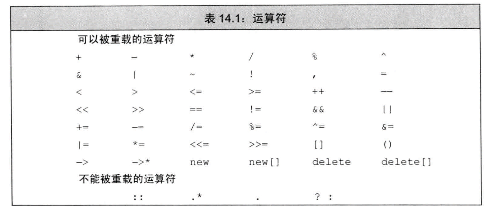
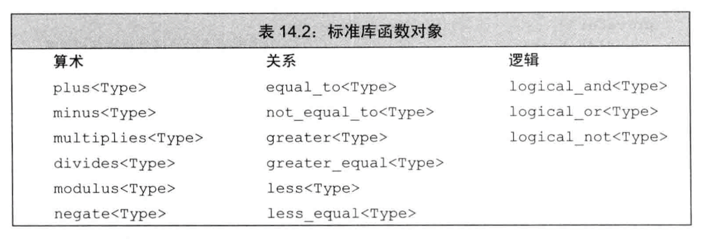
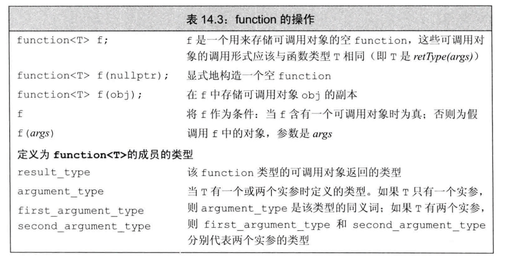

# 重载运算与类型转换
## 基本概念
重载运算符是具有特殊名字的函数：它们的名字由关键字operator和其后要定义的运算符号共同组成。重载运算符也包含返回类型、参数列表以及函数体。  
重载运算符函数的参数数量与该运算符的作用的运算对象的数量一样多。一元运算符有一个参数，二元运算符有两个。对于二元运算符来说，左侧运算对象传递给第一个参数，而右侧运算对象传递给第二个参数。除了重载的函数调用运算符operator()之外，其他重载运算符不能含有默认实参。  
当一个重载的运算符是成员函数时，this绑定到左侧运算对象。成员运算符函数的（显式）参数数量比运算对象的数量少一个。  
  
  对于一个运算符函数来说，它或者是类的成员，或者至少含有一个类类型的参数：
```cpp
//错误：不能为int重定义内置的运算符
int operator+(int,int);
```
这一约定意味着当运算符作用于内置类型的运算对象时，我们无法改变该运算符的含义。  
  
我们可以重载大多数（但不是全部）运算符。  
我们只能重载已有的运算符，而无权发明新的运算符号。  
有四个符号（+、-、*、&）既是一元运算符也是二元运算符，所有这些运算符都能被重载，从参数的数量我们可以推断到底定义的是哪种运算符。  
对于一个重载的运算符来说，其优先级和结合律与对应的内置运算符保持一致。  
  
### 直接调用一个重载的运算符函数
我们也能像调用普通函数一样直接调用运算符函数：
```cpp
data1+data2;
operator+(data1,data2);//等价
```
### 某些运算符不应该被重载
通常情况下，不应该重载逗号、取地址、逻辑与和逻辑或运算符。  
### 使用与内置类型一致的含义
每个运算符在用于内置类型时都有比较明确的含义。  
只有当操作的含义对于用户来说清晰明了时才使用运算符。如果用户对运算符可能有几种不同的理解，则使用这样的运算符将产生二义性。
### 赋值和复合赋值运算符
如果类含有算术运算符或者位运算符，则最好也提供对应的复合赋值运算符。
### 选择作为成员或者非成员
下面的准则有助于我们在将运算符定义为成员函数还是普通的非成员函数做出抉择：  
&emsp;●赋值（=），下标（[]）、调用（()）和成员访问箭头（->）运算符必须是成员。  
&emsp;●复合赋值运算符一般来说应该是成员函数，但并非必须。  
&emsp;●改变对象状态的运算符或者与给定类型密切相关的运算符，如递增、递减和解引用运算符，通常应该是成员。  
&emsp;●具有对称性的运算符可能转换任意一端的运算对象，例如算术、相等性、关系和位运算符等，因此它们通常应该是普通的非成员函数。  
当我们把运算符定义成成员函数时，它的左侧运算对象必须是运算符所属类的一个对象。

## 输入和输出运算符
### 重载输出运算符<<
```cpp
std::ostream &operator<<(std::ostream &os, const Sales_data &item) {
	os << item.isbn() << " " << item.units_sold << " " << item.revenue << " " << item.avg_price();
	return os;
}
```
第一个形参是一个非常量ostream对象的引用，第二个形参一般来说是一个常量的引用，该常量是我们想要打印的类类型。  
通常，输出运算符应该主要负责打印对象的内容而非控制格式，输出运算符不应该打印换行符。  
  
**输入输出运算符必须是非成员函数**   
因为符号运算左值是ostream类型的引用而不能是类类型。

### 重载输入运算符>>
```cpp
std::istream &operator>>(std::istream &is, Sales_data &item) {
	double price = 0;
	is >> item.bookNo >> item.units_sold >> price;
	if (is) //检查输入是否成功
		item.revenue = item.units_sold*price;
	else //输入失败则执行默认初始化
		item = Sales_data();
	return is;
}
```
第一个形参是运算符将要读取的流的引用，第二个形参是将要读取的流的引用，第二个形参是将要读入到的（非常量）对象的引用。  
输入运算符**必须处理输入可能失败的情况**，而输出运算符不需要。

## 算术和关系运算符
通常情况下，我们把算术和关系运算符定义成非成员函数以允许对左侧或右侧的运算对象进行转换。因为这些运算符一般不需要改变运算对象的状态，所以形参都是常量的引用。
```cpp
Sales_data operator+(const Sales_data &lhs, const Sales_data &rhs) {
	Sales_data sum = lhs;
	sum += rhs;
	return sum;
}
```
**如果类同时定义了算术运算符和相关的复合赋值运算符，则通常情况下应该使用复合赋值来实现算术运算符**。

### 相等运算符
```cpp
bool operator==(const Sales_data &lhs, const Sales_data &rhs) {
	return lhs.isbn() == rhs.isbn()
		&& lhs.units_sold == rhs.units_sold
		&& lhs.revenue == rhs.revenue;
}

bool operator!=(const Sales_data &lhs, const Sales_data &rhs) {
	return lhs.isbn() != rhs.isbn()
		|| lhs.units_sold != rhs.units_sold
		|| lhs.revenue != rhs.revenue;
}
```

### 关系运算符
定义了相等运算符的类也常常（但不总是）包含关系运算符。特别是，因为关联容器和一些算法要用到小于运算符，所以定义operator<会比较有用。  
如果存在唯一一种逻辑可靠的<定义，则应该考虑为这个类定义<运算符。如果类同时还包含==，则当且仅当<的定义和==产生的结果一致时才定义<运算符。

### 赋值运算符
除了拷贝赋值和移动赋值运算符，类还可以定义其他赋值运算符以使用别的类型作为右侧运算对象。  
例如，标准库vector类还定义了第三种赋值运算符，该运算符接受花括号内的元素列表作为参数。  
```cpp
vector<string> v;
v={"a","b","c"};
```
接受花括号内的元素列表作为参数的运算符无须检查对象向自身的赋值，这是因为它的形参initializer_list<string>确保li与this所指向的不是同一个对象。  
我们可以重载赋值运算符。不论形参的类型是什么，赋值运算符都必须定义为成员函数。
```cpp
//书上的实现中形参没有const和&，有什么区别，哪个更好，我的这种有没有问题（暂时测试没有发现问题）
StrVec& StrVec::operator=(const std::initializer_list<string> &li) {
	auto newdata = alloc_n_copy(li.begin(), li.end());
	free();
	elements = newdata.first;
	first_free = cap = newdata.second;
	return *this;
}
```

#### 复合赋值运算符
赋值运算符必须定义成类的成员，复合赋值运算符通常情况下也应该这样做。这两类运算符都应该返回左侧运算对象的引用。  
```cpp
Sales_data& Sales_data::operator+=(const Sales_data &rhs) {
	units_sold += rhs.units_sold;
	revenue += rhs.revenue;
	return *this;
}
```

## 下标运算符
如果一个类包含下标运算符，则它通常会定义两个版本：一个**返回普通引用**，另一个是**类的常量成员并且返回常量引用**。

## 递增和递减运算符
定义递增和递减运算符的类**应该同时定义前置版本和后置版本**。这些运算符**通常**应该被定义成**类的成员**。  
为了与内置版本保持一致，**前置运算符**应该**返回**递增或递减后对象的**引用**。    
为了与内置版本保持一致，后置运算符应该返回对象的原值（递增或递减之前的值），返回的形式是一个值而非引用。
```cpp
StrBlobPtr& StrBlobPtr::operator++() {
	check(curr, "increment past end of StrBlobPtr");
	++curr;
	return *this;
}

StrBlobPtr StrBlobPtr::operator++(int) {
	StrBlobPtr ret = *this;
	++*this; //后置运算符调用各自的前置版本来完成实际的工作
	return ret;
}
```
### 显式地调用后置运算符
如果我们想通过函数调用的方式调用后置版本，则必须为它的整型参数传递一个值：  

```cpp
StrBlobPtr p(a1);
p.operator++(0);//调用后置版本
p.operator++();//调用前置版本
```

## 成员访问运算符
解引用运算符（*）和箭头运算符（->）。  
```cpp
string& StrBlobPtr::operator*() const {
	auto p = check(curr, "dereferrnce past end");
	return (*p)[curr];
}
string* StrBlobPtr::operator->() const {
	return &this->operator*();
}
```
解引用运算符首先检查curr是否仍在作用范围内，**箭头运算符调用解引用运算符并返回解引用结果元素的地址**。     
重载的箭头运算符必须返回类的指针或者自定义了箭头运算符的某个类的对象。   
**解引用运算符得到的是在该地址的对象，而箭头运算符得到的是该地址的对象的成员。（个人理解！）**

## 函数调用运算符
如果类重载了函数调用运算符，则我们可以像使用函数一样使用该类的对象。  
```
struct absInt{
    int operator()(int val) const{
        return val<0?-val:val;
    }
}

int i = -42;
absInt absObj;
int ui = absObj(i);
```
即使absObj只是一个对象而非函数，我们也能“调用”该对象。调用该对象实际上是在运行重载的调用运算符。   
函数调用运算符必须是成员函数。一个类可以定义多个不同版本的调用运算符，相互之间应该在参数数量或类型上有所区别。  
如果类定义了调用运算符，则该类的对象称作**函数对象**。

### 含有状态的函数对象类
和其他类一样，函数对象类除了operator()之外也可以包含其他成员。函数对象类通常包含一些数据成员，这些成员被用于定制调用运算符中的操作。

### lambda是函数对象
具体参考[泛型算法]。
#### 表示lambda及相应捕获行为的类
```
auto wc = find_if(words.begin(),words.end(),
             [sz](const string &s) const 
                 {return s.size() >=sz;});
//该lambda表达式产生的类将形如：
class SizeComp{
public:
  SizeComp(size_t n):sz(n){}
  bool operator()(const string &s) const
      {return s.size() >= sz;}
private:
    size_t sz;
};
```

### 标准库定义的函数对象
标准库定义了一组表示算术运算符、关系运算符和逻辑运算符的类，每个类分别定义了一个执行命名操作的调用运算符。  
这些类都被定义成模版的形式，我们可以为其指定具体的应用类型，这里的类型即调用运算符的形参类型。
```
plus<int> intAdd;  //可执行int加法的函数对象
negate<int> intNegate;  //可对int值取反的函数对象
int sum = intAdd(10,20);
sum = intNegate(intAdd(10,20));
```
以下类型都定义在**functional头文件**。  
  
  
  
#### 在算法中使用标准库函数对象
表示运算符(关系)的函数对象类常用来替换算法中的默认运算符。  
```
//传入一个临时的函数对象用于执行两个string对象的>比较运算
sort(svec.begin(),svec.end(),greater<string>());
```
需要特别注意的是，**标准库规定其函数对象对于指针同样适用**。  
```
vector<string *> nameTable;
//错误：nameTable中的指针彼此之间没有关系，所以<将产生未定义的行为
sort(nameTable.begin(),nameTable.end(),
    [](string *a,string *b){return a<b;})
//正确：标准库规定指针的less是定义良好的
sort(nametable.begin(), nameTable.end(), less<string *>());
```
关联容器使用less<key_type>对元素进行排序，因此我们可以定义指针的set或者在map中使用指针作为关键值而无须直接声明less。

### 可调用对象与function
C++语言中有几种可调用**对象**，**函数**、**函数指针**、**lambda表达式**、**bind创建的对象**以及**重载了函数调用运算符的类**。 
#### 不同类型可能具有相同的调用形式
```
//普通函数
int add(int i,int j){return i+j;}
//lambda，其产生一个未命名的函数对象类
auto mod = [](int i,int j){return i%j;}
//函数对象类
struct divide{
    int operator()(int denominator,int divisor){
        return denominator / divisor;
    }
};
```
上面这些可调用对象，尽管它们的类型各不相同，但它们共享**同一种调用形式：int(int,int)**  
如果我们想将这些可调用对象存入一个map用于构建一个桌面计算器：
```
//map可以定义如下：
map<string,int(*)(int,int)> binops;
//正确：add是一个指向正确类型函数的指针
binops.insert({"+",add}); //map的组成元素是pair
//错误：mod不是一个函数指针
binops.insert({"%",mod});
```
我们无法存入divide和mod，问题在于每个lambda或函数对象类都有它自己的类类型。
#### 标准库 function 类型
我们可以使用名为function的标准库类型解决上述问题。定义在functional头文件中。  
  
  
    
```
function<int(int,int)> 
```
在这里我们声明了一个function类型，它可以表示接受两个int、返回一个int的可调用对象。
```
function<int(int,int)> f2 = divide();
function<int(int,int)> f3 = [](int i,int j){return i*j;};
cout<<f2(4,2)<<endl;  //2
cout<<f3(4,2)<<endl;  //8
```
使用这个function类型我们可以重新定义map:
```
map<string,function<int(int,int)>> binops = {
    {"+",add},
    {"-",std::minus<int>()},
    {"/",divide()},
    {"*",[](int i,int j){return i*j;}},
    {"%",mod}
};
```
这样我们就能把所有可调用对象，包括函数指针、lambda或者函数对象在内，都添加到这个map中去。  
```
cout<<binops["+"](10,5)<<endl; //15
```
#### 重载函数与function
我们不能直接将重载函数的名字存入function类型的对象中，因为存在二义性：
```
int add(int i,int j){return i+j;}
Sales_data add(const Sales_data&,const Sales_data&);
binops.insert({"+",add});  //哪个add？
```
解决方案一：存储函数指针
```
int (*fp)(int,int) = add;
binop[s.insert({"+",fp});
```
解决方案二：使用lambda
```
binops.insert({"+",[](int a,int b){retur add(a,b);}});
```

## 重载、类型转换与运算符
### 类型转换运算符
```
operator type() const;
```
其中type表示某种类型。  
一个类型转换函数必须是类的成员函数；它**不能声明返回类型，形参列表也必须为空**。类型转换函数通常应该是const。  
#### 定义含有类型转换运算符的类
```
class SmallInt{
public:
    SmallInt(int i=0):val(i){
        if(i<0||i>255)
            theow std::out_of_range("Bad SamllInt value");
    }
    operator int() const {return val;}
private:
    std::size_t val;
};
```
如上类既定义了向类类型的转换，也定义了从类类型向其他类型的转换。  
```
SmallInt si;
//首先将4隐式地转换成SmallInt，然后调用SmallInt::operator=
si=4;
//首先将si隐式地转换成int，然后执行整数的加法
si+3;
```
尽管编译器一次只能执行一个用户定义的类型转换，但是隐式的用户定义类型转换可以置于一个标准（内置）类型转换之前或之后，并与其一起使用。  
```
SmallInt si = 3.14;  //double->int int->SmallInt
si+3.14;  //SmallInt->int int->double
```
#### 类型转换运算符可能产生意外结果
在实践中，类很少提供类型转换运算符。但例外的是：定义向bool类型转换还是比较普遍的。  
```
int i = 42;
cin<<i;
```
上面的例子中，cin并没有定义输出运算符，故发生cin->bool 然后执行位运算，结果并不是我们想要的。
#### 显式的类型转换运算符
为了防止上面的情况发生，我们使用**显式的类型转换运算符**：
```cpp
explicit operator int(0 const { return val; }
```
```cpp
SmallInt si=3;  //正确：构造函数可以隐式调用
si+3;  //错误！类型转换不能隐式调用
static_cast<int>(si)+3;  //正确：显式的请求类型转换
```
该规定存在一个**例外**，即**如果表达式被用作条件，则编译器会将显式的类型转换自动应用于它**。
#### 转换为bool
向bool的类型转换通常用在条件部分，因此operator bool 一般定义为explicit的。  

### 避免有二义性的类型转换
通常情况下，不要为类定义相同的类型转换，也不要在类中定义两个及两个以上转换源（构造函数）或转换目标（类型转换运算符）是算术类型的转换。  
#### 实参匹配和相同的类型转换
```cpp 
struct B;
struct A{
    A()=default;
    A(const B&);  //把一个B转换成A
};
structB {
    B()=default;
    operator A() const;  //把一个B转换成A
};
A f(const A&);
B b;
A a = f(b);  //二义性错误：此处采用哪个转换呢？
```
如果我们实在想执行上述的调用，就不得不**显式地调用类型转换运算符或转换构造函数**。
```cpp
A a1 = f(b.operator A());
A a2 = f(A(b));
```
**static_cast无法用来解决二义性问题**，其本身就面临二义性问题。
#### 二义性与转换目标为内置类型的多重类型转换
```cpp
struct A{
    A(int = 0);
    A(double);
    operator int() const;
    operator double() const;
};
void f2(long double);
A a;
f2(a);  //A->int->long double ? A->double0>long double ? 存在二义性问题
long lg;
A a2(lg);  //long->int->A ? long->double->A ? 存在二义性问题
```
哪个类型转换都无法精确匹配long double。然而这两个类型转换都可以使用。于是产生了二义性问题。  
当我们使用两个用户定义的类型转换时，如果转换函数之前或之后存在标准类型转换，则标准类型转换将决定最佳匹配到底是哪个。   
**经验规则：**  
&emsp;●不要令两个类执行相同的类型转换。   
&emsp;●避免转换目标是内置算术类型的类型转换。  
一言以蔽之：除了显式地向bool类型的转换之外，我们应该尽量避免定义类型转换函数并尽可能地限制那些“显然正确”的非显式构造函数。
#### 重载函数与转换构造函数
```cpp
struct C{
    C(int);
};
struct D{
    D(int);
};
void manip(const &C);
void manip(const &D);
//二义性错误：该调用manip的哪一个重载呢？
manip(10);  
```
当然调用者可以通过显式调用转换构造函数来消除二义性：
```cpp
manip(C(10));
```
**但是**，如果在调用重载函数时我们需要使用构造函数或者强制类型转换来改变实参的类型，则这通常意味着程序的设计存在不足。
#### 重载函数与用户定义的类型转换
```cpp
struct E{
    E(double);
};
void manip(const &C);
void manip(const &E);
//二义性错误：二义性依然存在
//当调用重载函数时，多个可执行函数请求多个类型转换方式,这个过程并不考虑标准类型转换的级别
//int->C ? int->double->E ?
manip(10);
```
**调用重载函数这个过程并不考虑标准类型转换增加的额外转换层数**。

### 函数匹配与重载运算符
重载的运算符也是重载的函数。因此，通用的函数匹配规则（P208）同样适用于判断在给定的表达式中到底应该使用内置运算符还是重载的运算符。  
当我们调用一个命名的函数时，具有该名字的成员函数和非成员函数不会彼此重载，这是因为我们用来**调用命名函数的语法形式对于成员函数和非成员函数来说是不相同的**。当我们通过类类型的对象进行函数调用时，只考虑该类的成员函数。而**当我们在表达式中使用重载的运算符时，无法判断正在使用的是成员函数还是非成员函数，因此二者都应该在考虑的范围内**。   
```cpp
class SmallInt {
    friend SmallInt operator+(const SmallInt&,const SmallInt&);
public:
    SmallInt(int = 0);
    operator int() const {return val;}
private:
    std::size_t val;
};
SmallInt s1,s2;
//二义性错误
SmallInt s3 = s1 + s2;  
```