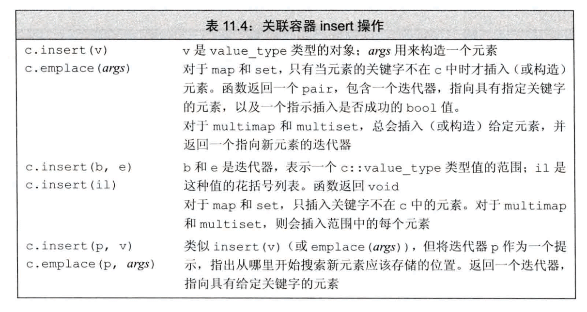
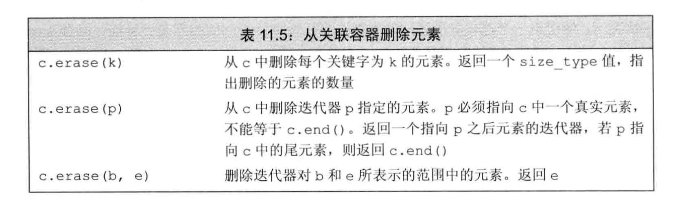
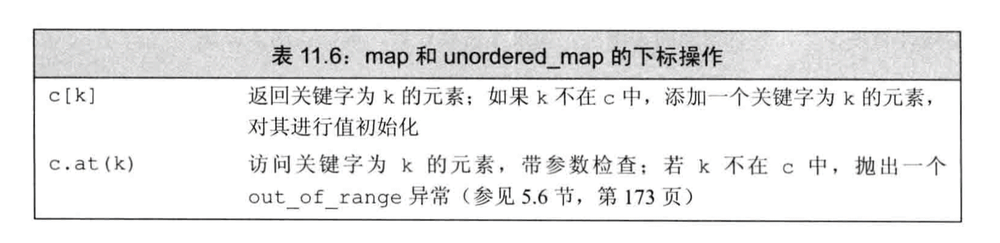
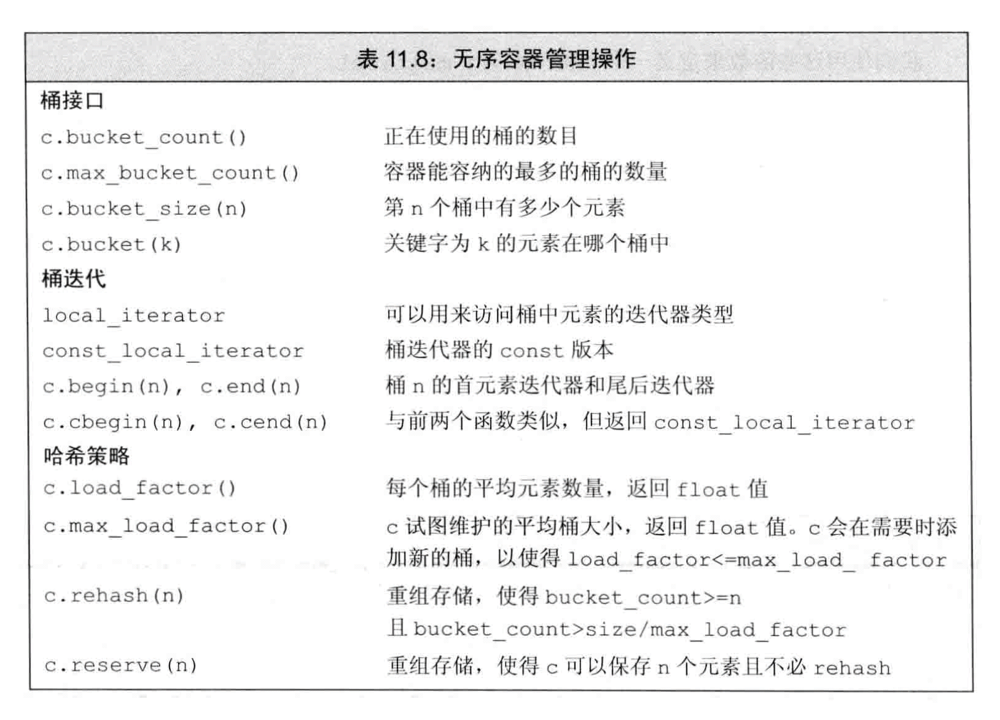

# 关联容器
map、multimap定义在头文件map中；set和multiset定义在头文件set中；无序容器则定义在头文件unordered_map和unordered_set中。
## 关联容器概述
### 定义关联容器
#### 构造函数
##### map
```
map<string,size_t> word_count;//空容器
map<string,string> authors = {{"Jyce","James"},{"Austen","Jane"}};//使用{{key,value},{...}...}关键字-值对
```
##### set
set的初始化和vector之类的没什么区别。
##### multimap & multiset
multimap和multiset允许多个元素具有相同的关键字。

### 关键字类型的要求
在集合类型中，关键字类型就是元素类型；在映射类型中，关键字类型就是元素的第一部分类型。  
#### 有序容器的关键字类型
一个类型定义了“行为正常”的<运算符，则它可以用作关键字类型。
#### 使用关键字类型的比较函数
当我们使用的类型没有定义<运算符时，我们应该自己提供一个比较操作。
```
//如 对于Sales_data类型我们自己提供了一个比较函数compareIsbn
multiset<Sales_data,decltype(compareIsbn) *> bookstroe(compareIsbn);
//构造函数括号里应该是&compareIsbn，但是这里不加&编译器也能自己处理，效果是一样的。
//如果不使用decltype我们也可以选择使用typedef
typedef bool (*pf)(const Sales_data & lhs,const Sales_data & rhs);
multiset<Sales_data,pf> bookstore(compareIsbn);
```
为了使用自己定义的操作，在定义multiset时我们必须提供两个类型：关键字类型、比较操作类型——应该是一种函数指针类型。  
我们使用decltype来指出自动易操作的类型。当用decltype来获取一个函数指针类型时，必须加上 一个*来指出我们要使用一个给定的函数类型的指针。

### pair类型
定义在头文件utility中。  
类似容器，pair是一个用来时声称特定类型的模版。当创建一个pair时，我们必须提供两个类型名，pair的数据成员将具有对应的类型。
```
pair<string,int> si{"cbg",24};
```
pair的默认构造函数对数据成员进行默认初始化。  


#### 创建pair对象的函数
如果一个函数需要返回一个pair，有如下几种方式。
```
pair<string,int> process(vector<string> &v){
    if(v.empty()) return pair<string,int>();//隐式构造返回值
    else
    方式一：
        return {v.back(),v.back().size()};//列表初始化
    方式二：
        return pair<string,int>(v.back(),v.back().szie());
    方式三:
        return make_pair(v.nack(),v.back().size());//make_pair函数的两个类型来自参数
}
```

## 关联容器操作
|关联容器额外的类型别名||
:-|:-
key_type|此容器类型的关键字类型
mapped_type|每个关键字关联的类型；只适用于map
value_type|对于set，与keytype相同；对于map，为pair<const key_type,mapped_type>
### 关联容器迭代器
当解引用一个关联容器的迭代器时，我们会得到一个类型为容器的value_type的值的引用。  
关键字是const的，所以map的迭代器的key_type和set的迭代器都是const的。  
#### 遍历关联容器
map、set都支持begin、end操作。当使用一个迭代器遍历一个map、set、multimap、multiset时，迭代器按关键字升序遍历元素。
#### 关联容器和算法
通常不对关联容器使用泛型算法。  
关联容器可用于只读取元素的算法。  
使用关联容器定义的专用find成员会比调用泛型find快得多。  
实际编程中，如果我们真要对一个关联容器使用算法，要么是将它当作一个源序列，要么当做一个目的位置。

### 添加元素
#### insert
向容器添加一个元素或一个元素范围。犹豫map和set（以及对应的无序类型）包含不重复的关键字，因此插入一个已存在的元素对容器没有任何影响。
```
set2.insert(v.begin(),v.end());
set2.insert({1,2,3,4,5,6,7,8,9,1,3});
```
对于一个给定的关键字，只有第一个带有此关键字的元素才被插入到容器中。  
对一个map进行insert操作时，必须记住，元素类型是pair。


#### 检测insert的返回值
insert(或emplace)返回的值依赖于容器类型和参数。
##### 对于不包含重复关键字的容器
添加单一元素的insert和emplace版本返回一个**pair**。
```
//向word_count插入一个元素关键字word值1，返回值存在ret
pair<map<string,size_t>::iterator,bool> ret = word_count.insert(make_pair(word,1));
```
返回值类型可以看出，ret.first为一个指向插入元素的迭代器，ret.second为一个bool值，表示是否插入成功，否的话表示值已存在。
##### 对于允许重复关键字的容器
接收单个元素的insert操作返回一个指向新元素的迭代器。**没有返回一个bool值**，因为insert总是会向这类容器中添加一个新元素。

### 删除元素
关联容器定义了三个版本的erase，其中一个是关联容器提供的额外erase操作，接受一个key_type参数。


### map的下标操作
map和unordered_map容器提供了下标运算符和一个对应的at函数。  
**我们不能对一个 const map或const unordered_map使用下标操作，因为下标操作可能会向const map/const unordered_map中插入元素。  **
set类型不支持下标，因为set中没有与关键字对应的值。  
我们不能对一个multimap或一个unordered_multimap进行下标操作，因为这些容器中可能有多个值与一个关键字相关联。
与数组或者vector上的下标操作很不同：**使用一个不在map容器中的关键字作为下标，会添加一个具有此关键字的元素到map中。**  

#### 使用下标操作的返回值
与vector和string不同，map的下标运算符返回的类型与解引用map迭代器得到的类型不同。  
map下标操作获得一个mapped_type对象；但当解引用一个map迭代器时，会得到一个value_type对象（一个pair<key_type , mapped_type>）。

### 访问元素
#### find & count
如果我们所关心的只不过是一个特定元素是否已在容器中，可能find是最佳选择。也就是说，如不需要计数，最好使用find。


#### lower_bound & upper_bound
重要用在允许元素重复的容器。  
如果关键字在容器中，lower_bound返回的迭代器将**指向第一个具有给定关键字的元素**，而upper_bound返回的迭代器则**指向最后一个匹配给定关键字的元素之后的位置**。
如果关键字不在容器中，则lower_bound & upper_bound会返回**相等**的迭代器——**指向一个不影响排序的关键字插入位置**。
#### equal_range
equal_range返回一个pair，此pair的first成员保存的迭代器与lower_bound返回的迭代器是一样的，second成员保存的迭代器与uppper_bound的返回值是一样的。

## 无序容器
共四种：unordered_map unordered_set unordered_multimap unordered_multiset  
这些容器不是使用比较运算符来组织元素，而是使用一个哈希函数和关键字类型的==运算符。  
在某些应用中，维护元素的序代价非常高昂，此时无序容器就很有用。  

### 使用无序容器
除了哈希管理操作之外，无需容器也提供了与有序容器相同的操作（find、insert等）。

### 管理桶
无序容器在存储上组织为一组桶，每个通保存零个或多个元素。  
无序容器使用一个哈希函数将元素映射到桶。容器将具有一个特定哈希值的所有元素都保存在相同的桶中。所有具有相同关键字的元素也都会在同一个桶中。  
对于相同的参数，哈希函数必须总是产生相同的结果。  
哈希函数能将每个特定的值映射到唯一的桶，但将不同关键字的元素映射到相同的桶也是允许的。  
当一个桶保存多个元素时，需要顺序搜索这些元素来查找我们想要的那个。计算一个元素的哈希值和在桶中搜索通常都是很快的。  

  
### 无序容器对关键字类型的要求
默认情况下，无序容器使用关键字类型的==运算符来比较元素，它们还使用一个hash<key_type>类型的对象来生成每个元素的哈希值。  
我们可以直接定义关键字是内置类型（包括指针类型）、string或智能指针类型的无序容器。  
对于自定义类型，我们需要提供函数来替代==运算符和哈希值计算函数。或提供我们自己的hash模版版本。